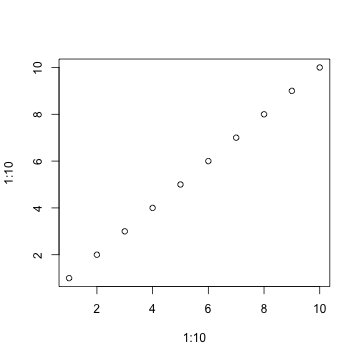

## Why take notes?

* Multiple information sources
    * Class presentations as PDFs
    * Extra information verbally
    * Web pages are a huge source of information
    * Print media (textbooks, computer books)
* Organize information to suit personal preferences
    * writing in your own words reinforces learning
    * extract just the important bits
    * organize the information the way you want

---

## Why not just paper or word processor?

* paper is hard to organize on the fly
* formulas $\bar x = \frac{\sum x}{n}$ can be hard in word processors
* learn code by running it, so put code and output together

```r
plot(1 : 10, 1 : 10)
```

 

---

## Study notebook

* list of topics defined in an easily changed csv file
<pre>
Topic, markdown
About this app, about.md
Arithmetic Mean, arithmean.md
</pre>
* each topic is defined in its own markdown file
    * markdown supports easy formatting for readability
    * markdown supports mathematical notation
    * one file per topic makes it easy to add topics
* Also supports a live application for each topic (next slide)
* See the prototype [Study notebook](https://gardnerpomper.shinyapps.io/DevelopingDataProducts/)

---

## Each topic can have its own live application tab
* each topic can have its own custom layout and controls in the *App* tab. This example shows 1 input control (latex_formula) and one output (latex_render), with a submit button (latex_go)
<pre>
    "latex.md" = fluidRow(
            column(3,
                   textInput(inputId="latex_formula",label="Formula (latex format)"),
                             actionButton("latex_go","Show!")),
            column(6,withMathJax(),uiOutput('latex_render'))
            ),
</pre>
*  custom server-side code renders to the custom UI in the tab. This example renders the text in _latex_formula_ into _latex_go_ in mathematical notation
<pre>
    output\$latex_render <- renderUI({
            input\$latex_go
            withMathJax(paste0('\$\$',isolate(input\$latex_formula),'\$\$'))
    })
</pre>
